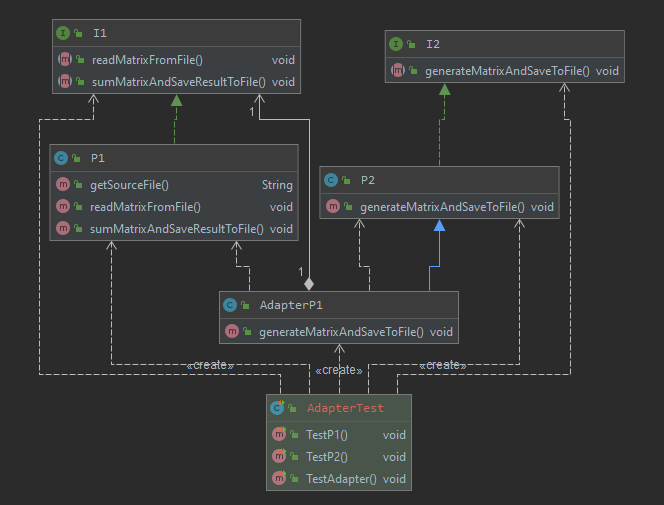

# ДЗ: Шаблон Адаптер
Написать простую консольную программу П1, с интерфейсом вызова И1, которая читает данные о двух матрицах А и В из файла F0, складывает матрицы и сохраняет результат А+В в другой файл F1.

Написать вторую консольную программу П2, которая может генерить данные матриц А и В и писать их в файл с именем F2.

Чтобы она могла их просуммировать, следует сделать адаптер для программы П1, который позволит программе П2 вызвать П1.
1. Написать программу П1
2. Написать программу П2, включив туда адаптер вызова и использования программы П1
3. Написать автотест для проверки функционирования

# Диаграмма классов
